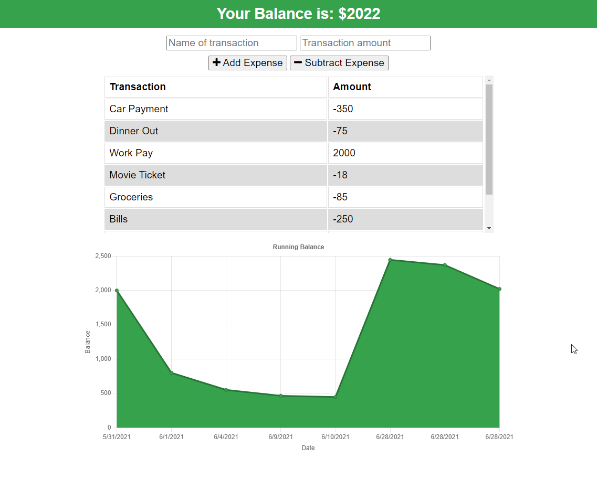

# **Expense Tracker (PWA)**
 &emsp;&emsp;

&nbsp;
## **Table of Contents**
  - [**Description**](#description)
  - [**Live Application**](#live-application)
  - [**Application Screenshots and Demo**](#application-screenshots-and-demo)
  - [**Technologies and Services**](#technologies-and-services)
  - [**License**](#license)

&nbsp;
## **Description**
Expense Tracker provides a digital ledger to record financial transactions and visual graphics to let a user maintain awareness of their current budget. The application operates as a single page app, from which a user can record any incoming or outgoing transaction. Transactions are recorded and saved to a database, and displayed to the user via a table to show all recent transactions and via a line plot to show the running balance total over time. 

Expense Tracker is a full stack web application following the MVC design paradigm. It uses mongoDB as its NoSQL database and mongoose.js as the object document mapper. Views are provided from the server as static HTML files and include associated JavaScript to handle dynamic rendering changes on the client without interaction with the server. The server runs on node.js and uses the express web framework. Additionally this site is developed as a progressive web app (PWA) enabling offline functionality. When offline entered expenses are saved to the browser indexedDB database for temporary storage. Once the application reestablishes a network connect it submits all locally stored transactions to the server database and clears the local storage. 

The web application is hosted on Heroku for demonstration. 

&nbsp;
## **[Live Application](https://spf-expense-tracker.herokuapp.com/)**
## **Application Screenshots and Demo**

&nbsp;
## **Technologies and Services**
Development Technologies
- Database/Models: MongoDD, Mongoose (ODM)
- Client/Views: HTML, CSS, JavaScript
- Server/Controllers: Node.js, Express.js

External Frameworks, Services, and Credits
- [Chart.js](https://www.chartjs.org/)
- [Font Awesome](https://fontawesome.com/)
- Webpack

&nbsp;
## **License**
Licensed under the [MIT](./LICENSE) license.